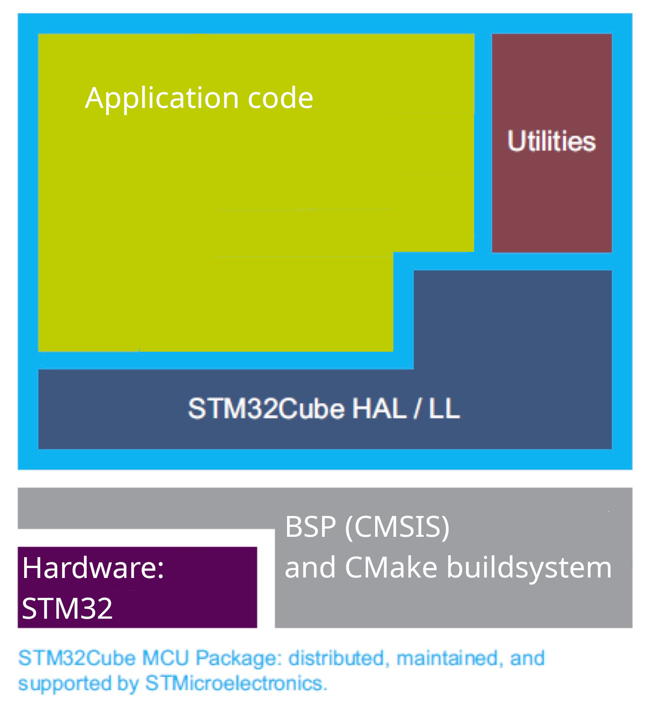

# Getting started with CMake barebones development on a STM32F0 series MCU

The STM32F051xxx microcontroller included in the STM32F0Discovery kit is based on the Cortex-M0+ architecture. Software for this microcontroller can be developed using the STM32CubeIDE or a custom toolchain. We will be setting up the latter option here.

## What is your toolchain composed of?
Your development toolchain for the STM32F051 microcontroller, as part of the STM32F0Discovery kit, typically consists of the following components:

- Hardware Abstraction Layer (HAL): The HAL for the STM32F051 is provided by STMicroelectronics and is known as the STM32 HAL. While it may not be the most elegant in terms of design, it is quite practical for basic applications. This HAL can be easily downloaded and incorporated into the build process by your build system.

- Board Support Package (BSP): The BSP for the STM32F051 typically includes CMSIS (Cortex Microcontroller Software Interface Standard) headers, which provide a somewhat standardized layer of low-level code to facilitate interaction with the hardware. Additionally, the BSP contains linker scripts, debug scripts, and in this specific instance, CMake files.

- Build System: For the STM32F051, the build system commonly employed is CMake, in conjunction with the ARM GCC (GNU Compiler Collection) compiler. While ARM GCC is a popular choice, alternatives such as Keil MDK or IAR Systems compilers are also available and can be used based on personal preference or to requirement needs.

- Debug Tools: For this setup, Segger Ozone is the recommended debugger. However, you are not restricted to using it. If there is another debugging tool that you prefer or are more comfortable using, you are at liberty to use that tool instead.

The above components work together to provide an environment for developing, building, and debugging software for the STM32F051 microcontroller.

### What is the software hierarchy?
The figure below is a top-down view of the software hierarchy. On top is your application code, then your STM HAL and Low level library and at the bottom your CMSIS with CMake buildsystem. 




### What's next?

First start by trying to understand the [stm32-cmake project](https://github.com/ObKo/stm32-cmake). This project contains useful scripts which help you with setting-up your development environment. 

## Toolchain files

Toolchain files specify the build, link and other cmake options needed to build your project. 
> See [CMake toolchains wiki page](https://cmake.org/cmake/help/latest/manual/cmake-toolchains.7.html)

### Why are you telling this?

The stm32-cmake project contains a toolchain file which helps you set-up your development environment. The file is located in the `cmake` subfolder.

There are two ways of specifying a toolchain file to use in CMake..

- The first method is by placing it after the CMake command.
```bash
$ cmake . -B build -DCMAKE_TOOLCHAIN_FILE=somepath/cmake/stm32_gcc.cmake
```
- The second method is by setting an internal variable:
```cmake
set(CMAKE_TOOLCHAIN_FILE somepath/cmake/stm32_gcc.cmake)
```

### Tip! Make use of CMake internal variables

CMake has its own internal variables describing filepaths or other useful things see the [CMake wiki](https://cmake.org/cmake/help/latest/manual/cmake-variables.7.html#id10).

#### Another Tip! For the sake of it :)
One CMake variable that might be useful is [`CMAKE_BINARY_DIR`](https://cmake.org/cmake/help/latest/variable/CMAKE_BINARY_DIR.html). 

## Include the stm32-cmake project in to your cmake and build

> See [CMake_basics.md](CMake_basics.md) for ways to download it into your project

Then tell cmake to use the toolchain file provided by the stm32-cmake project

After which CMake will configure the basics of the toolchain using the toolchain file:
- It will set Linker flags
- It will set Compiler flags
- It will set the linker script and startup/reset code


## Take a look at the examples in the stm32-cmake project
When you take a look at the CMakeLists.txt in the stm32-cmake you might notice it does several things besides the basic cmake skeleton:
- It uses functions like:
```cmake
stm32_fetch_cmsis(F4)
stm32_fetch_hal(F4)
stm32_print_size_of_target(stm32-fetch-f4)
```
- It uses the find_package function:
```cmake
find_package(CMSIS COMPONENTS STM32F407VG REQUIRED)
find_package(HAL COMPONENTS STM32F4 REQUIRED)
```
- And last but not least it might link the executable with HAL and CMSIS components:
```cmake
add_executable(stm32-fetch-f4 ${PROJECT_SOURCES})
target_link_libraries(stm32-fetch-f4 CMSIS::STM32::F407VG STM32::NoSys)
```

## BSP folder
As you might have noticed this repo contains a bsp folder. 

**This bsp folder contains an .svd file and config header for the STM32 hal. Include this config header in the build** 

**The .svd file contains the hardware peripheral descriptions and locations for the debugger. This doesn't need to be included in the build.**


## Success?
How do I know if my CMake is setup as it should? There are many indicators.. One of these is the status code the build returns. If CMake and build return status 0, it means you set-up cmake succesfully. Good Job! 

Now try to debug using Segger Ozone! 
> See [debug_ozone.md](debug_ozone.md) for instructions on how to use Segger Ozone to debug your project.

## Help! It doesn't work

### `warning: _close is not implemented and will always fail`
Ah this is one of the most annoying warnings you can get. This means you are missing the `_close` function in the compilation sources. Therefore the Linker says: "Hey this is not implemented". The function is used in stdlib for file handling. The manufacturers of microcontrollers don't always implement these functions.

How to fix? Try to remove the `STM32::NoSys` flag from the `target_link_libraries()` command.

### `Could not find toolchain file: path`
This means one of three things:
- The project folder has a long folderpath or space/weird characters in filepath.
- The stm32-cmake project hasn't been downloaded into the project properly
- The path to the toolchain file is incorrect.

To fix it:
*First* try to double check the filepath

*If that doesn't work* check if the stm32-cmake project is downloaded properly in to your project.

*Last resort*, try to move the complete project to another location with shorter folderpath e.g. home folder or root of drive.
